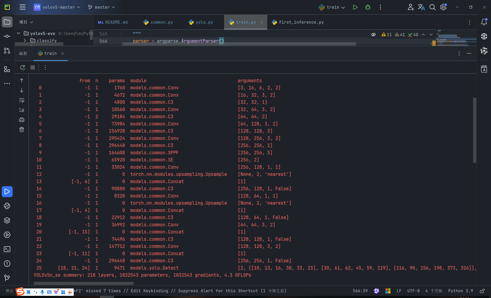

# Yolov5-Evo

## 项目介绍
本项目是基于ultralytics-Yolov5-v6.0的做的一些优化和学习。主要目的是提升算法的检测速度和模型压缩后的精度

## 主要功能
- 1: 增强了Yolov5的训练过程
超参数的进化:https://github.com/ultralytics/yolov5/issues/607

- 2: C3模块替换为yolov8的c2f模块

- 3: 引入注意力机制
    引入SE模块的网络结构如下图：
    

4. 后处理nms加入ciou和giou增强小目标的检测性能

5. 替换主干网络为MobileNetV3 提高fps

6. 重新训练后的模型，使用yolov5-6.0-m网络结构做教师模型，知识蒸馏新的MobileNet主干模型，提升map。

## 注意
- 1、在最新的yolov5-v7.0中，作者已经加入了ciou和giou的nms，所以不需要再自己实现。实际测试中ciou和giou的nms效果在密集目标和小目标上都有很好大的提升
只是时间的开销略高，所以作者没有加入，这里我建议使用giou的nms平衡速度和精度。
- 2、c2f模块的替换反而在我的项目测试效果没有c3模块好，可能是我的应用场景的问题，这还有待验证。因为实际测试中，yolov8的map值和fps都不如yolov5。
- 3、训练过程加入后面几轮取消数据增强，对于训练过程可以提速，且map值会得到一点提升，可以考虑使用在你的项目中。
- 4、替换MobileNet后，fps支持三路视频流，但是map值降低得很严重，需要优化精度。
由于一些保密原因，暂无法提供更多优化代码。

